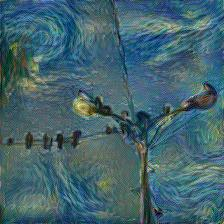
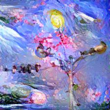
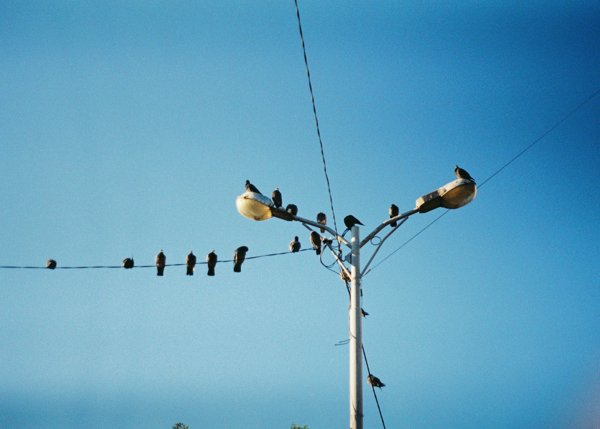
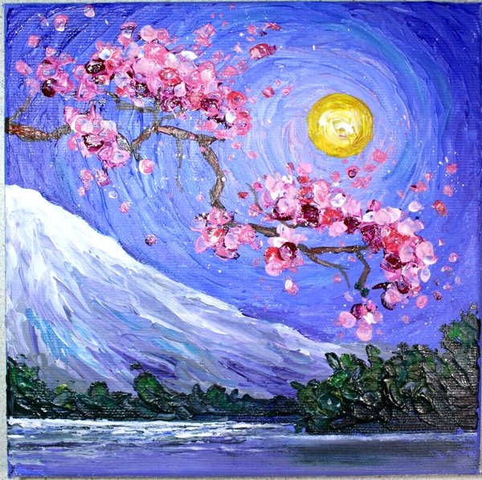
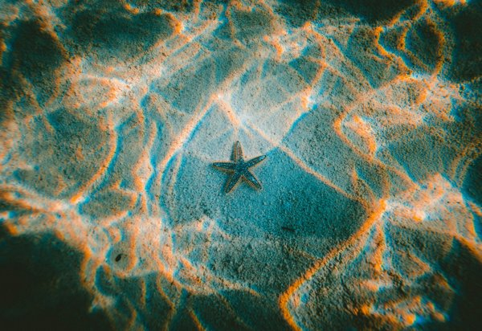
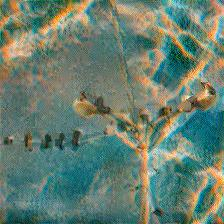

# Neural Style Transfer

PyTorch reimplementation of [*A Neural Algorithm of Artistic Style*](https://arxiv.org/abs/1508.06576) (Gatys et al., 2015).

<p>
  
  
</p>

## Overview

Neural style transfer separates and recombines the content and style of two images using a pretrained CNN. Content is represented by feature activations at a deep layer (conv4_1), while style is captured via Gram matrices — channel correlation statistics — computed across five layers. The generated image starts from random noise and is optimized directly with L-BFGS to minimize a weighted combination of content and style losses.

This implementation follows the paper closely, including the MaxPool → AvgPool substitution recommended by the authors for smoother gradients.

## Results

| Content | Style | Output |
|---------|-------|--------|
|  |  |  |
|  |  |  |
|  |  |  |

## Setup

```bash
# requires Python 3.12+
pip install torch torchvision matplotlib
```

Or with [uv](https://github.com/astral-sh/uv):

```bash
uv sync
```

## Usage

```bash
uv run main.py --content inputs/content.jpg --style inputs/style.jpg
```

Output is saved to `output/<content>_x_<style>.jpg`. Each run is logged to `output/runs.jsonl`.

**Options:**

| Flag | Default | Description |
|------|---------|-------------|
| `--content` | required | Path to content image |
| `--style` | required | Path to style image |
| `--output` | auto | Output path |
| `--steps` | 1000 | Optimization steps |
| `--alpha` | 1.0 | Content loss weight |
| `--beta` | 1e8 | Style loss weight |

The `alpha`/`beta` ratio controls the style-content tradeoff — increasing `beta` produces more stylized results at the cost of content structure.

## Project Structure

```
├── main.py               # style transfer logic + CLI
├── extractor.py          # VGG19 feature extractor (hook-based)
├── loss.py               # content loss, style loss, Gram matrix
├── config.py             # layer config, image constants
├── utils.py              # image loading, denormalization
└── visualize_features.py # visualize VGG feature maps and Gram matrices
```

## Reference

Leon A. Gatys, Alexander S. Ecker, Matthias Bethge — [*A Neural Algorithm of Artistic Style*](https://arxiv.org/abs/1508.06576), 2015.